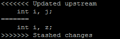

目录
================
* [简介](#overview)
* [用法介绍](#introduce)
	* [新建repository并且push代码](#solution1)
	* [提交代码时远程库有更新](#solution2)
* [markdown语法参考](#foot)


<h4 id="overview">简介(abstract)</h4>
<p>这是关于我在工作中使用常用的步骤和遇到的问题分享出来方便参考</p>
<h4 id="introduce">用法介绍</h4>
<h5 id="solution1">1.新建repository并且push代码</h5>

```
git init
git add --all
git commit -m 'ok'
git remote add origin https://github.com/darenone/es6.git
git push -u origin master
```

<h5 id="solution2">2.提交代码时远程库有更新</h5>

```
git status
git stash 
git pull 
git stash pop stash@{'版本号'}
git add --all
git commit -m 'explain'
git push origin master
```
**注意**
<p style="font-size: 14px;">如果你在提交代码时出现以下error，那说明你的代码和别人提交的代码有冲突，这个时候你需要确认进行手动更改</p>




<h4 id="foot">简介(abstract)</h4>
#### markdown语法参考
<p>如果你行入门markdown syntax 请点击一下链接</p>
* [markdown简易入门教程](https://www.jianshu.com/p/20e82ddb37cb#doc)
* [Markdown 语法整理大集合2017](https://www.jianshu.com/p/b03a8d7b1719)